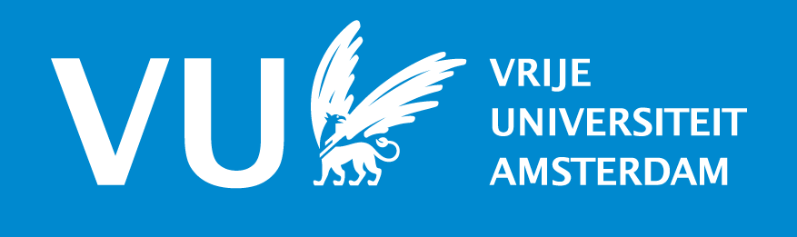
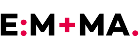

## #BridginG (NWO Digital Society)

Hello! This is the project page of our NWO Digital Society project _The future is now: how language use bridges generations online_ ([NWO announcement](https://www.nwo.nl/actueel/nieuws/2020/02/vijf-nieuwe-onderzoeken-naar-de-digitale-samenleving.html))

### Description

Many urgent societal challenges, like climate change, require generations to align their interests, but
online discussions sometimes escalate. We combine computational methods on large-scale observational
online data with laboratory and field experiments—to develop both data- and theory-driven interventions
that will help citizens, journalists and organizations bring generations together online.

### Who?

* Dong Nguyen, Utrecht University (co-PI)
* Tijs van den Broek, VU Amsterdam (co-PI)
* Ton Baetens, EMMA
* Bianca Beersma, VU Amsterdam
* Hans Moors, EMMA
* Kees van Deemter, Utrecht University
* Anna Wegmann, Utrecht University

